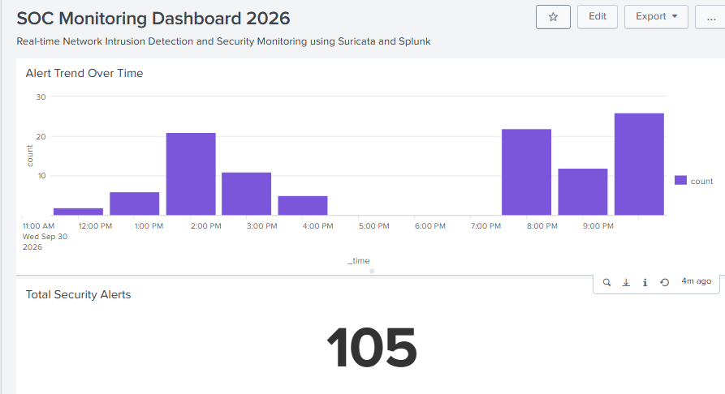
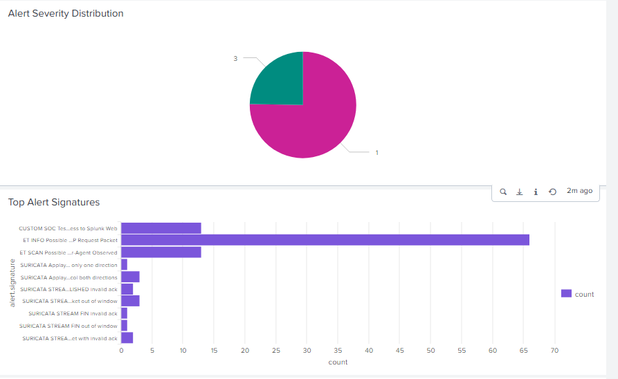
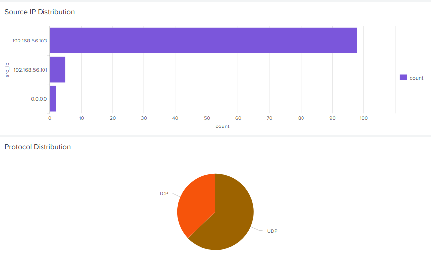
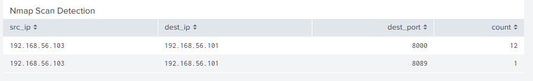
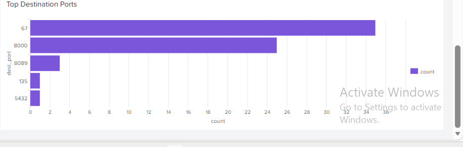

# Network Intrusion Detection & SOC Monitoring

A cybersecurity project that integrates **Suricata IDS** with **Splunk SIEM** for network traffic monitoring, intrusion detection, security event analysis, and SOC dashboard visualization.

## Architecture

```text
Kali Linux
    ↓
Suricata IDS
    ↓
eve.json
    ↓
Splunk Universal Forwarder
    ↓
Splunk Enterprise
    ↓
SOC Dashboard
```

## Technologies

* Kali Linux
* Suricata IDS
* Splunk Enterprise
* Splunk Universal Forwarder
* Nmap
* TCP/IP Networking
* SIEM
* Network Intrusion Detection

## Key Features

* Real-time network traffic monitoring using Suricata
* Detection of suspicious network activity
* Nmap scan detection
* Custom Suricata detection rule
* JSON-based security event logging
* Forwarding Suricata events to Splunk
* Security event investigation using Splunk Search
* SOC monitoring dashboard
* Alert severity analysis
* Source IP analysis
* Protocol and network traffic analysis
* Time-based security event monitoring

## Splunk Analysis Queries

The following Splunk Search Processing Language (SPL) queries were used for security monitoring, threat detection, investigation, and SOC dashboard analysis.

### 1. View Suricata Alerts

```spl
index=main sourcetype=suricata event_type=alert
```

Displays security alerts generated by Suricata and received by Splunk.

### 2. Alert Severity Distribution

```spl
index=main sourcetype=suricata event_type=alert
| stats count by alert.severity
```

Analyzes the distribution of detected alerts by severity level.

### 3. Top Alert Signatures

```spl
index=main sourcetype=suricata event_type=alert
| stats count by alert.signature
| sort - count
```

Identifies the most frequently triggered Suricata detection signatures.

### 4. Source IP Distribution

```spl
index=main sourcetype=suricata event_type=alert
| stats count by src_ip
| sort - count
```

Identifies source IP addresses associated with detected security events.

### 5. Alert Trend Over Time

```spl
index=main sourcetype=suricata event_type=alert
| timechart span=1h count
| where count>0
```

Visualizes the number of security alerts over time for SOC monitoring.

### 6. Nmap Scan Detection

```spl
index=main sourcetype=suricata event_type=alert alert.signature="ET SCAN Possible Nmap User-Agent Observed"
| stats count by src_ip dest_ip dest_port
| sort - count
```
### 7. Top Destination Ports

```spl
index=main sourcetype=suricata event_type=alert
| stats count by dest_port
| sort - count
| head 10
```

Shows the most frequently observed destination ports in Suricata security alerts, helping identify network services involved in detected activity.


Identifies Nmap reconnaissance activity detected by Suricata and forwarded to Splunk.

## Custom Detection Rule

A custom Suricata rule was created to detect TCP traffic sent to the Splunk Web service:

alert tcp any any -> 192.168.56.101 8000 (msg:"CUSTOM SOC Test - Access to Splunk Web"; sid:1000001; rev:1;)

This rule generates a custom Suricata alert when TCP traffic is sent to port 8000 of the Splunk Web service.

The rule was tested using controlled traffic, and the generated alert was successfully forwarded to Splunk for security event investigation.

## Custom Rule Verification

The custom Suricata detection event was verified in Splunk using:

```spl
index=main sourcetype=suricata "CUSTOM SOC Test"
| spath path=alert.signature output=custom_signature
| table _time src_ip src_port dest_ip dest_port proto custom_signature alert.severity
```

This confirms that the custom Suricata rule generated an event and that the event was successfully forwarded to Splunk.

## Testing

The system was tested using controlled Nmap scans against the Windows Splunk host.


### Nmap Service Detection

```bash
sudo nmap -sS -sV 192.168.56.101
```

This was used to perform controlled service discovery and verify Suricata detection.

### Port Scanning

```bash
sudo nmap -sS -p 1-1000 192.168.56.101
```

This was used to generate controlled network scanning activity for IDS testing.

Suricata successfully detected the Nmap activity and forwarded the resulting security events to Splunk for further analysis and visualization.

Testing was performed within an isolated virtual lab environment.

## MITRE ATT&CK Mapping

| Detection Activity | MITRE ATT&CK Technique | Technique ID |
|---|---|---|
| Nmap network scanning | Network Service Scanning | T1046 |

The Nmap scanning activity performed during controlled testing maps to the
Network Service Scanning technique in the MITRE ATT&CK framework.

This demonstrates how network reconnaissance activity detected by Suricata
can be mapped to a recognized adversary technique.

## Incident Investigation Workflow

The project follows a basic Security Operations Center (SOC) investigation workflow:

```text
Network Activity
       ↓
Suricata Detection
       ↓
Security Event
       ↓
Splunk Investigation
       ↓
Validate Activity
       ↓
Document Findings
```

## Project Flow

```text
Network Traffic
      ↓
Suricata IDS
      ↓
Security Events
      ↓
eve.json
      ↓
Splunk Universal Forwarder
      ↓
Splunk Enterprise
      ↓
SOC Monitoring Dashboard
      ↓
Security Analysis
```

## SOC Dashboard

### Dashboard Overview



### Alert Analysis



### Network Traffic Analysis



### Nmap Scan Detection



### Top Destination Ports




## Detection and Alerting

Suricata provides network intrusion detection by generating security alerts for suspicious network activity.

The detected events are forwarded to Splunk Enterprise for searching, investigation, analysis, and dashboard visualization.

This project focuses on IDS detection and SIEM-based investigation. Automated Splunk alert notifications are not enabled in the current Splunk Free license environment.

## Investigation Notes

Additional port-anomaly queries were used during the investigation of specific network events. These included analysis of ports such as **8089, 135, and 5432**.

These investigation-specific queries are not included in the core public README because the six SPL queries above provide the main security monitoring and detection workflow.

## Lab Environment

This project was developed and tested in a controlled virtual lab environment using **Kali Linux and Windows virtual machines**.

### Lab Architecture

```text
Kali Linux VM
├── Suricata IDS
├── eth0 → NAT
└── eth1 → Host-Only Network
             │
             │ 192.168.56.0/24
             │
             ↓
Windows 11 VM
├── Splunk Enterprise
├── Splunk Web
└── TCP Receiving Port 9997
```

## Project Structure

```text
Network-Intrusion-Detection-SOC/
│
├── README.md
├── .gitignore
│
├── suricata/
│   ├── custom.rules
│   └── suricata.yaml
│
├── splunk/
│
└── screenshot/
    ├── soc-dashboard-overview.png
    ├── soc-dashboard-alerts.png
    ├── soc-dashboard-traffic.png
    ├── soc-dashboard-nmap-final.png
    └── soc-dashboard-ports.png

```

## Skills Demonstrated

* Network Intrusion Detection
* Security Information and Event Management (SIEM)
* Suricata IDS
* Splunk Enterprise
* Splunk Universal Forwarder
* SPL Query Development
* Security Event Investigation
* Network Traffic Analysis
* Nmap Reconnaissance Detection
* Custom IDS Rule Creation
* SOC Dashboard Development
* Log Collection and Analysis
* Cybersecurity Monitoring

## Project Outcome

The project demonstrates an end-to-end network security monitoring workflow using **Suricata and Splunk**.

Network traffic is inspected by Suricata, security events are stored in `eve.json`, and the events are forwarded to Splunk for centralized analysis and visualization.

The project provides practical experience in **IDS deployment, SIEM integration, security event investigation, network reconnaissance detection, SPL development, and SOC dashboard creation**.
